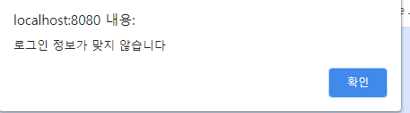

# PortalService

Spring Mvc 구조로 만든 간단한 Portal Service를 구현해보았음


**IDE**:InteliJ

**framework**:Spring

**Tool**:bootstrap

**Database**:mysql


하면서 알게된 공부사실들

URL:https://github.com/Renoris/portalservice/blob/master/README_Study.md


**데이터 베이스 테이블은 총 6개**

계정정보를 저장하는 'Useraccount'

게시판 정보를 저장하는 'Gallery'

게시판의 댓글을 저장하는 'Comment'

개인의 Todo를 저장하는 'Mydaily'

게임의 Score를 저장하는 'Score'

사진관의 사진정보를 저장하는 'MyPicture' 로 저장되어있음


## 로그인페이지


간단한 로그인 화면으로 구현. 

입력시 

```java
@PostMapping(path = "/login")
public Model Login(HttpServletRequest request, HttpServletResponse response, Model model, HttpSession session, @ModelAttribute UserAccount userAccount) throws IOException {
    try {
        userAccount=accountdao.get(userAccount.getName(), userAccount.getPassword());
        if (userAccount != null) {
            session.setAttribute("userAccount", userAccount);
            model.addAttribute("msg", "로그인 성공");
            response.sendRedirect("/lobby.html");
            return model;
        } else {
            model.addAttribute("msg", "로그인 정보가 맞지 않습니다");
            return model;
        }
    } catch (Exception e) {
        model.addAttribute("msg", "로그인 정보가 맞지 않습니다");
        return model;
    }
}
```

로그인 컨트롤러에서 받아서 Dao를 통해 유저를 판별후 로그인이 가능하면 Main page로 보낸다.



만약 Dao 찾지못한다고 한다면 로그인 정보가 맞지않다는 alter메세지를 추가


HandlerIntercepter를 통해 만약 로그인없이 다른페이지에 진입하려고 하면 로그인화면으로 돌아오도록 구성

```java
@Override
public boolean preHandle(HttpServletRequest request, HttpServletResponse response, Object handler) throws Exception {
    String requestUrl = request.getRequestURL().toString();
    HttpSession session = request.getSession();
    if(requestUrl.contains("/login")||requestUrl.contains("/createaccount")||requestUrl.contains("/resources")){
        return true;
    }

    else {
        Object obj = session.getAttribute("userAccount");
        if (obj == null) {
            response.sendRedirect("/login");
            return false; // 더이상 컨트롤러 요청으로 가지 않도록 false로 반환함
        }
        else{
            return true;
        }
    }
}
```


## MainPage


**메인 화면**

기본적으로 갤러리를 띄워주며 DAO에서 작성자와 작성일 게시글 제목만 받아와서 출력

Controller는 단순히 이런식으로 동작

```java
@GetMapping(path ="/lobby")
public void lobbycreate(Model model, HttpSession session) throws IOException {
    model.addAttribute("galleryList", galleryDao.getAll());

}
```

```java
public ArrayList<Gallery> getAll() {
    ArrayList<Gallery> galleryList = new ArrayList<>();
    Object[] params = new Object[]{};
    String sql = "select id, name, posttitle, postdate from gallery";
    return jdbcTemplate.query(sql, params, rs -> {
        Gallery gallery = null;
        while (rs.next()) {
            gallery = new Gallery();
            gallery.setId(rs.getInt("id"));
            gallery.setName(rs.getString("name"));
            gallery.setPosttitle(rs.getString("posttitle"));
            gallery.setPostdate(rs.getDate("postdate"));
            SimpleDateFormat format1=new SimpleDateFormat("MM-dd");
            SimpleDateFormat format2=new SimpleDateFormat("HH:mm");
            String datestring=format1.format(rs.getDate("postdate"));
            String timestring=format2.format(rs.getTime("postdate"));
            String datetime=datestring+" "+timestring;
            gallery.setOutdate(datetime);
            galleryList.add(gallery);
        }
        return galleryList;
    });
}
```

DAO로는 모든 gallery를 검색해서 뿌려주는 방식

다만 현재와서 생각하기에 나중에 rest api식으로 하면 index 마다 분리해서 따로 요청해서 뿌려주는게 나을꺼라고 생각함


## 게시글 내부


아래에 댓글을 쓸수있는 창과 댓글을 쓰면 게시글 하단에 댓글이 쌓이게됨

Contoller

```java
@PostMapping(path ="/gallery")
public Model createcomment(@RequestParam Integer id,Model model ,HttpSession session, @ModelAttribute Comment comment) throws IOException {
    Gallery gallery=galleryDao.get(id);
    comment.setCommentdate(new java.util.Date());
    comment.setGalleryid(id);
    UserAccount userAccount=(UserAccount) session.getAttribute("userAccount");
    comment.setName(userAccount.getName());
    commentDao.insert(comment);
    ArrayList<Comment> comments=commentDao.getAll(id);
    model.addAttribute("username",userAccount.getName());
    model.addAttribute("commentlist",comments);
    model.addAttribute("msg","댓글이 등록되었습니다");
    model.addAttribute("gallery", gallery);
    return model;
}
@GetMapping(path="/deletecomment")
    public Model deletecomment(@RequestParam Integer id, HttpSession session,Model model){
        try {
            UserAccount userAccount = (UserAccount) session.getAttribute("userAccount");
            Comment comment = commentDao.get(id);
            if(comment.getName().equals(userAccount.getName())||userAccount.isAdmin()){
                commentDao.delete(id);
                model.addAttribute("msg", "정상적으로 삭제되었습니다.");
                return model;
            }
            else{
                model.addAttribute("msg", "코멘트 작성자가 아닙니다.");
                return model;
            }
        } catch (Exception e) {
            model.addAttribute("msg", "잘못된 시도입니다.");
            return model;
        }
    }
```

댓글 관련해서 수정삭제는 a태그로 댓글의 index에 해당하는 요청을 보내고 작성자가 아니면 삭제할수 없도록 구성


## 미니게임


마우스 클릭으로 곤충을 잡는게임, 곤충의 위치는 클릭할때마다 이동하며 시간은 대략 1초정도로 구성

자신이 가장 높은점수를 달성할때마다 score를 갱신하도록 구성

게임은 js로 동작


Controller

```java
@PostMapping(path ="/buggame")
public Model insertscore(@ModelAttribute GameScore score,Model model, HttpSession session) {
    try {
        UserAccount userAccount = (UserAccount) session.getAttribute("userAccount");
        score.setName(userAccount.getName());
        score.setDate(new java.util.Date());
        if(scoreDao.get_name(userAccount.getName())==null){
            scoreDao.insert(score);
            model.addAttribute("msg", "첫 기록입니다.");
        }
        else{
            if(score.getScore()>scoreDao.get_name(userAccount.getName()).getScore()){
                scoreDao.update(score);
                model.addAttribute("msg", "기록 갱신");
            }
        }
        ArrayList<GameScore> gameScores=scoreDao.getAll();
        model.addAttribute("scorelist",gameScores);
        return model;
    } catch (Exception e) {
        model.addAttribute("msg", "잘못된 시도입니다.");
        return model;
    }
}
```


## todo


일정관련된 기능이 있으면 좋을것 같아서 넣어봄

이 일정은 자기 자신만 작성한것이 보이고 남이 작성한것은 보이지 않도록 구성

```java
@PostMapping(path ="/mydaily")
    public Model createmydaily(@ModelAttribute Mydaily mydaily,Model model, HttpServletResponse response, HttpSession session) throws IOException {
        try {
            UserAccount userAccount = (UserAccount) session.getAttribute("userAccount");
            mydaily.setName(userAccount.getName());
            mydailyDao.insert(mydaily);
            model.addAttribute("msg", "정상적으로 등록되었습니다.");
            ArrayList<Mydaily> mydailies=mydailyDao.getMydailyAll(userAccount.getName());
            model.addAttribute("mydailylist",mydailies);
            return model;
        } catch (Exception e) {
            model.addAttribute("msg", "잘못된 시도입니다.");
            return model;
        }
    }
@GetMapping(path="/deletemydaily")
    public Model deletcomment(@RequestParam Integer id, HttpSession session,Model model){
        try {
            UserAccount userAccount = (UserAccount) session.getAttribute("userAccount");
            Mydaily mydaily = mydailyDao.get(id);
            if(mydaily.getName().equals(userAccount.getName())){
                mydailyDao.delete(id);
                model.addAttribute("msg", "정상적으로 삭제되었습니다.");
                return model;
            }
            else{
                model.addAttribute("msg", "당신은 일정 작성자가 아닙니다. 옳지 않은 요청을 보내지 마십시오");
                return model;
            }
        } catch (Exception e) {
            model.addAttribute("msg", "잘못된 시도입니다.");
            return model;
        }
    }
```

또한 get방식이기때문에 다른 사용자가 본인것이 아닌 index를 타고들어오는것을 방지하기 위해서 마찬가지로 session값 조회후 방지


## 사진관


간단히 사진을 올리는 곳 

```java
@PostMapping(path ="/mypicture")
public ModelAndView createmypicture(@RequestParam("file") MultipartFile file, HttpServletRequest request,HttpSession session) throws IOException {
    File path = new File(request.getServletContext().getRealPath("/")+"/WEB-INF/static/resources/images/"+file.getOriginalFilename());
    FileOutputStream fileOutputStream = new FileOutputStream(path);
    BufferedOutputStream bufferedOutputStream = new BufferedOutputStream(fileOutputStream);
    bufferedOutputStream.write(file.getBytes());
    bufferedOutputStream.close();//여기까지 저장
    ModelAndView modelAndView=new ModelAndView();
    Mypicture mypicture=new Mypicture();
    mypicture.setPicturetitle(request.getParameter("picturetitle"));
    mypicture.setPicturedate(new java.util.Date());
    mypicture.setPictureurl("/resources/images/"+file.getOriginalFilename());
    UserAccount userAccount=(UserAccount) session.getAttribute("userAccount");
    mypicture.setName(userAccount.getName());
    mypictureDao.insert(mypicture);
    modelAndView.addObject("mypicturelist",mypictureDao.getAll());
    return modelAndView;
}
  @GetMapping(path="/deletemypicture")
    public Model deletemypicture(@RequestParam Integer id, HttpSession session,Model model){
        try {
            UserAccount userAccount = (UserAccount) session.getAttribute("userAccount");
            Mypicture mypicture = mypictureDao.get(id);
            if(mypicture.getName().equals(userAccount.getName())||userAccount.isAdmin()){
                mypictureDao.delete(id);
                model.addAttribute("msg", "정상적으로 삭제되었습니다.");
                return model;
            }
            else{
                model.addAttribute("msg", "사진 게시자가 아닙니다.");
                return model;
            }
        } catch (Exception e) {
            model.addAttribute("msg", "잘못된 시도입니다.");
            return model;
        }
    }

```


